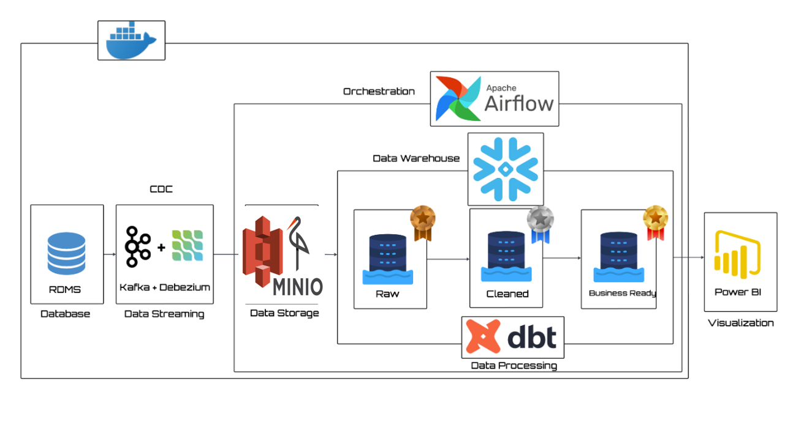
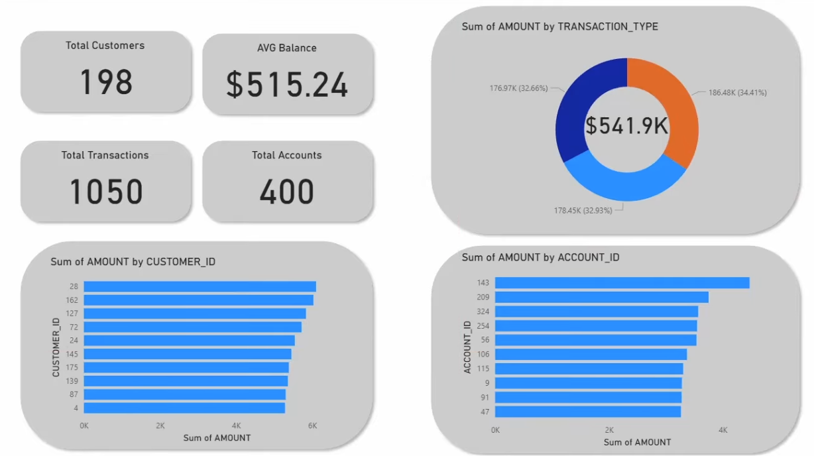

# 🏦 Banking Modern Data Stack

---

📌 Présentation du projet

Ce projet illustre une pipeline de données moderne de bout en bout appliquée au secteur bancaire.
Il simule des données de clients, de comptes et de transactions, diffuse les changements en temps réel, transforme ces données en modèles prêts pour l’analyse, et visualise les résultats — en suivant les bonnes pratiques de CI/CD et de data warehousing.

👉 En résumé, c’est un écosystème de données bancaires complet construit avec des outils modernes.

🏗️ Architecture

Flux de la pipeline :

Générateur de données → Simule les transactions, comptes et clients bancaires (via Faker).

Kafka + Debezium → Diffuse les changements en temps réel (CDC) vers MinIO (stockage compatible S3).

Airflow → Orchestre l’ingestion et les snapshots vers Snowflake.

Snowflake → Entrepôt de données Cloud (Bronze → Silver → Gold).

DBT → Effectue les transformations et construit les marts & snapshots (SCD Type-2).

Power BI →  Création du Dashboard

⚡ Stack technologique

Snowflake → Entrepôt de données cloud

DBT → Transformations, tests, snapshots (SCD Type-2)

Apache Airflow → Orchestration & planification de DAGs

Apache Kafka + Debezium → Streaming temps réel & CDC

MinIO → Stockage d’objets compatible S3

PostgreSQL → Base de données source (OLTP)

Python (Faker) → Génération de données simulées

Docker & docker-compose → Environnement containerisé

✅ Fonctionnalités principales

PostgreSQL OLTP : Base transactionnelle respectant les contraintes ACID (clients, comptes, transactions)

Système bancaire simulé : clients, comptes et opérations bancaires

Capture de changement de données (CDC) via Kafka + Debezium (lecture du WAL de Postgres)

Modèles DBT : Raw → Staging → Faits & Dimensions

Snapshots : suivi historique des données (slowly changing dimensions)

Orchestration automatique avec Airflow

📂 Structure du dépôt
banking-modern-datastack/
         
├── banking_dbt/              # Projet DBT
│   ├── models/
│   │   ├── staging/           # Modèles de staging
│   │   ├── marts/             # Tables de faits & dimensions
│   │   └── sources.yml
│   ├── snapshots/             # Snapshots SCD2
│   └── dbt_project.yml
├── consumer
│   └── kafka_to_minio.py
├── data-generator/            # Générateur de données avec Faker
│   └── faker_generator.py
├── docker/                    # DAGs Airflow, plugins, etc.
│   ├── dags/                  # DAGs (minio_to_snowflake, scd_snapshots)
├── kafka-debezium/            # Connecteurs Kafka & logique CDC
│   └── generate_and_post_connector.py
├── postgres/                  # Schéma Postgres (DDL & seeds)
│   └── schema.sql
├── .gitignore
├── docker-compose.yml         # Infrastructure containerisée
├── dockerfile-airflow.dockerfile
├── requirements.txt
└── README.md

⚙️ Mise en œuvre étape par étape
1. Simulation des données

Génération de données bancaires synthétiques (clients, comptes, transactions) avec Faker.

Insertion dans PostgreSQL (OLTP) pour simuler un vrai système transactionnel (ACID, contraintes).

Configuration via config.yaml.

2. Kafka + Debezium (CDC)

Configuration de Kafka Connect & Debezium pour capturer les changements dans Postgres.

Diffusion des événements CDC vers MinIO.

3. Orchestration avec Airflow

Création de DAGs pour :

Ingestion MinIO → Snowflake (Bronze).

Planification des snapshots & chargements incrémentaux.

4. Entrepôt de données Snowflake

Organisation en couches Bronze → Silver → Gold.

Création de schémas de staging pour l’ingestion initiale.

5. Transformations DBT

Modèles de staging → nettoyage et normalisation des sources.

Modèles de faits et dimensions → création des marts.

Snapshots → suivi historique des clients et comptes.

6. Création du Dashboard avec Power BI

📊 Livrables finaux

Pipeline CDC automatisée de Postgres → Snowflake

Modèles DBT (faits, dimensions, snapshots)

DAGs Airflow orchestrés

Jeu de données bancaires synthétiques pour démonstration

Dashboard Power BI pour le suivi en temps réel des données bancaires

