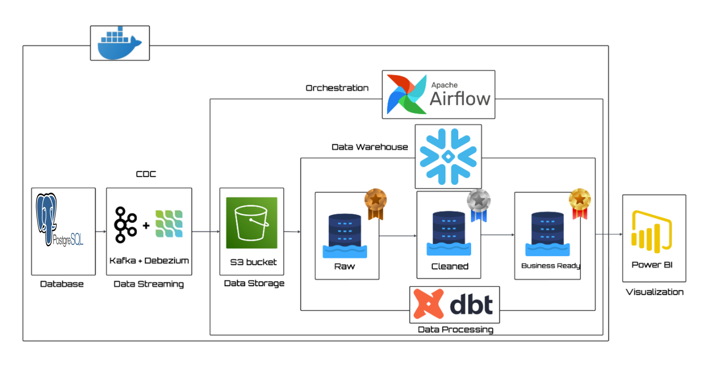
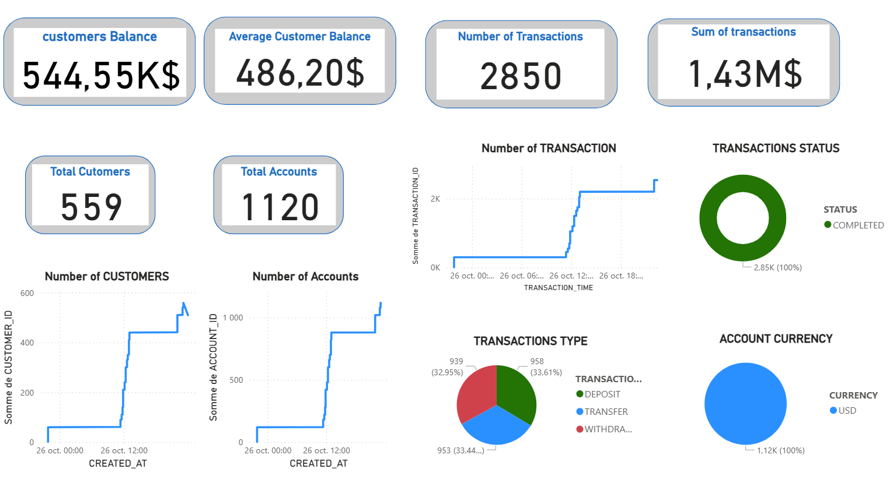

# 🏦 Banking Modern Data Stack

---

📌 Présentation du projet

Ce projet illustre une pipeline de données moderne de bout en bout appliquée au secteur bancaire.
Il simule des données de clients, de comptes et de transactions, diffuse les changements en temps réel, transforme ces données en modèles prêts pour l’analyse, et visualise les résultats — en suivant les bonnes pratiques de data warehousing.

👉 En résumé, c’est un écosystème de données bancaires complet construit avec des outils modernes.

🏗️ Architecture

Flux de la pipeline :

Générateur de données → Simule les transactions, comptes et clients bancaires (via Faker).

Kafka + Debezium → Diffuse les changements en temps réel (CDC) vers(Amazon S3).

Snowpipe → Ingestion automatique de S3 vers Snowflake

Snowflake → Entrepôt de données Cloud (Bronze → Silver → Gold).

Airflow →  les snapshots vers Snowflake.

DBT → Effectue les transformations et construit les marts & snapshots (SCD Type-2).

Power BI →  Création du Dashboard

Dokcer → Conténerisation

⚡ Stack technologique

Snowflake → Entrepôt de données cloud

DBT → Transformations, tests, snapshots (SCD Type-2)

Apache Airflow → Orchestration & planification de DAGs

Apache Kafka + Debezium → Streaming temps réel & CDC

Amazon S3 → Data lake

PostgreSQL → Base de données source (OLTP)

Python (Faker) → Génération de données simulées

Docker & docker-compose → Environnement containerisé

✅ Fonctionnalités principales

PostgreSQL OLTP : Base transactionnelle respectant les contraintes ACID (clients, comptes, transactions)

Système bancaire simulé : clients, comptes et opérations bancaires

Capture de changement de données (CDC) via Kafka + Debezium (lecture du WAL de Postgres)

Ingestion automatique depuis s3 vers snowflake via snowpipe

Modèles DBT : Raw → Staging → Faits & Dimensions

Snapshots : suivi historique des données (slowly changing dimensions)

Orchestration automatique avec Airflow

📊 Livrables finaux

Jeu de données bancaires synthétiques pour démonstration

Pipeline CDC automatisée de Postgres → Snowflake

Modèles DBT (faits, dimensions, snapshots)

DAGs Airflow orchestrés

Dashboard Power BI pour le suivi en temps réel des données bancaires

